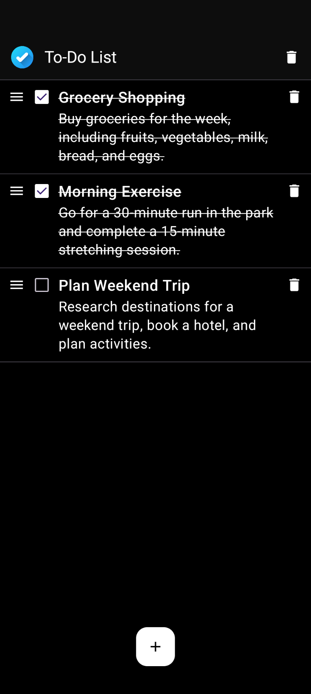

## Overview
To-Do List Android app.

## Installation
Google Play link coming soon!

## Key Features
- Add, edit, and delete To-Do items.
- Mark To-Do items as complete or incomplete.
- Reorder To-Do items with drag & drop.
- Save To-Do items to storage.

## Screenshots

  
  

## Built With
- [Compose](https://developer.android.com/develop/ui/compose) - Android’s modern toolkit for building native UI with a declarative approach.
- [Room](https://developer.android.com/jetpack/androidx/releases/room) - A persistence library that provides an abstraction layer over SQLite to allow for more robust database access while harnessing the full power of SQLite.
- [Hilt](https://developer.android.com/training/dependency-injection/hilt-android) - A dependency injection library for Android that reduces the boilerplate of doing manual dependency injection in your project.
- [Material3](https://m3.material.io/develop/android/jetpack-compose) - A design system that provides a set of principles and components for creating modern, adaptive UIs in Jetpack Compose.
- [DataStore](https://developer.android.com/topic/libraries/architecture/datastore) - A data storage solution that allows you to store key-value pairs or typed objects with built-in support for Kotlin coroutines and Flow.
- [Kotest](https://kotest.io/) - A flexible and comprehensive testing library for Kotlin, offering a range of testing styles and extensive assertion capabilities.
- [JUnit5](https://junit.org/junit5/) - A testing framework for Java and Kotlin that provides powerful tools for writing and running tests.
- [MockK](https://mockk.io/) - A mocking library for Kotlin that simplifies the creation of mocks, stubs, and spies, providing a powerful way to handle complex testing scenarios.
- [Kotlin Coroutines](https://developer.android.com/kotlin/coroutines) - Simplify asynchronous programming by allowing you to write concurrent code that is more readable and maintainable.
- [Reorderable](https://github.com/Calvin-LL/Reorderable) - A Jetpack Compose library that allows you to create reorderable lists and grids with drag-and-drop functionality.
- [Tap Target Compose](https://github.com/PierfrancescoSoffritti/tap-target-compose) - A Jetpack Compose library that helps you guide users by highlighting specific UI elements with customizable tap targets.
